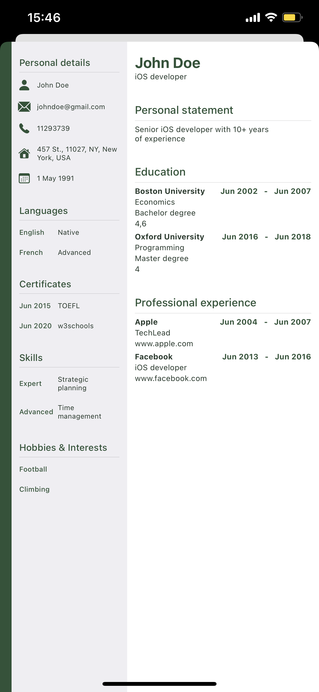
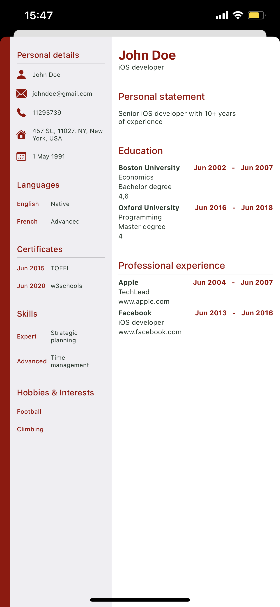
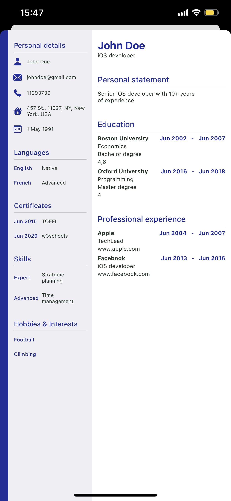
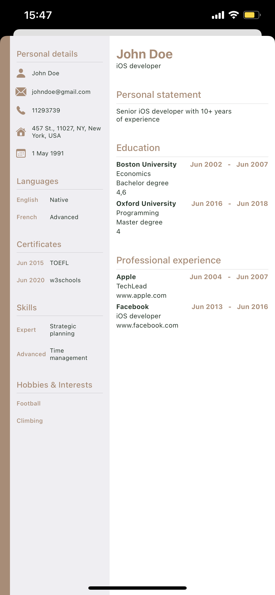

# CV-Maker
Native iOS application that generates CV as PDF file from your personal information. Made with Swift and SwiftUI. Requires iOS 15+

## How it works?

<video width="270" height="480" controls>
  <source src="v1.mp4" type="video/mp4">
    Your browser does not support the video tag.
</video>

## Choose your design...

<table>
  <tr>
    <td></td>
    <td></td>
    <td></td>
    <td></td>
  </tr>
 </table>
